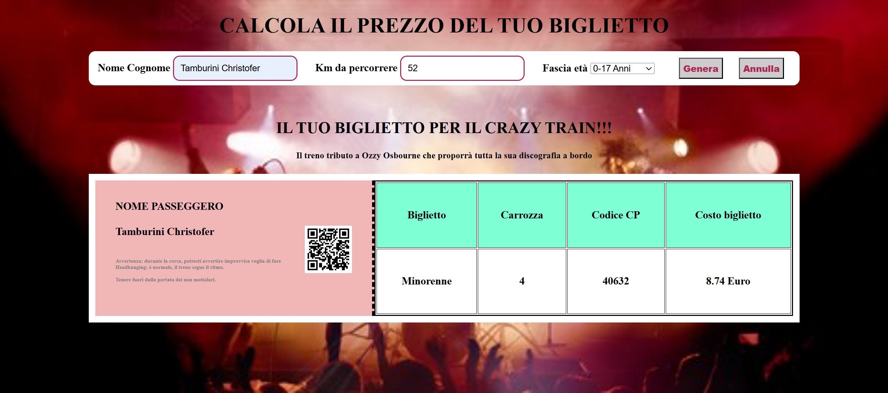

<h1 align="center">Calcolo del prezzo del biglietto del treno</h1>

###

  
  
  
  
  
  
  

###

Descrizione: Scrivere un programma che chieda all’utente: Il numero di chilometri da percorrere Età del passeggero Sulla base di queste informazioni dovrà calcolare il prezzo totale del biglietto di viaggio, secondo le seguenti regole: il prezzo del biglietto è definito in base ai km (0.21 € al km) va applicato uno sconto del 20% per i minorenni va applicato uno sconto del 40% per gli over 65.  MILESTONE 1: Iniziamo implementando il programma senza alcuna estetica: usando esclusivamente due input e un bottone (non stilizzati), realizziamo le specifiche scritte sopra. La risposta finale (o output) sarà anch’essa da scrivere in console.   MILESTONE 2: Solo una volta che il milestone 1 sarà completo e funzionante allora realizzeremo un form in pagina in cui l’utente potrà inserire i dati e visualizzare il calcolo finale con il prezzo.  Il recap dei dati e l'output del prezzo finale, andranno quindi stampati in pagina (il prezzo dovrà essere formattato con massimo due decimali, per indicare i centesimi sul prezzo). Questo richiederà un minimo di ricerca.  MILESTONE 3: Ora che la logica è funzionante in pagina, possiamo andare a dedicarci allo stile, raffinando la parte di HTML e CSS in modo da renderla esteticamente gradevole.  Nota: Se non vi sentite particolarmente creativi, questa (allegato) potrebbe essere un’implementazione da seguire per il terzo milestone. Potete scegliere di implementare una soluzione completamente diversa oppure simile, ma in ogni caso cercate di farla vostra. 🎨

###

